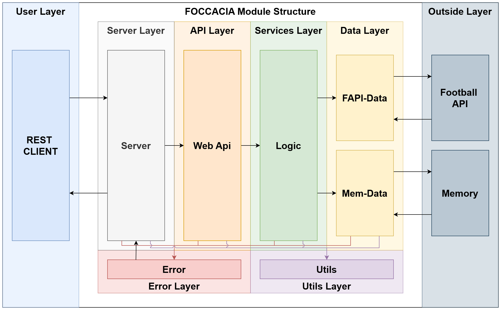
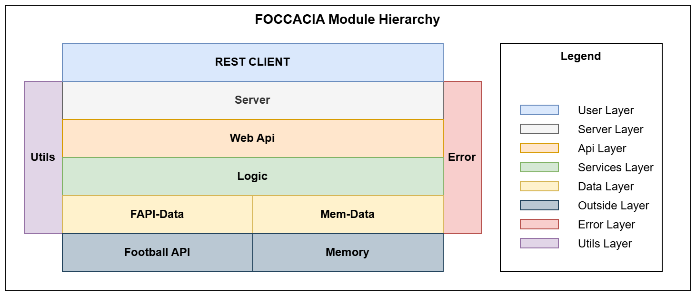
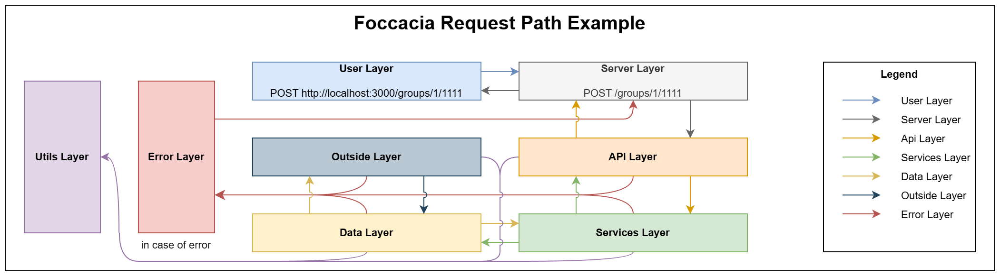

# FOCCACIA - FOotball Complete Clubs API and Chelas Internet Application

## Overview

FOCCACIA is a web application developed as part of the **Internet Programming/Introduction to Web Programming** course at **Instituto Superior de Engenharia de Lisboa**. The application provides a RESTful API for managing football competitions, teams, and user-created "Best XI" groups. It integrates with the [API Football](http://api.football-data.org/v4/) to fetch real-world football data.

This project is part of the **Winter Semester of 2025/2026 – 2nd Practical Assignment (Part 1)**.



---

## Features

### Functional Requirements
The FOCCACIA application supports the following features:

1. **Competitions**
   - Retrieve a list of available competitions, including their code and name.

2. **Teams**
   - Retrieve teams for a specific competition and season, including:
     - Team name
     - Country
     - Players (name, position, nationality, age)

3. **"Best XI" Groups**
   - Create a group with a name, description, competition, and year.
   - Edit a group's name and description.
   - List all groups.
   - Delete a group.
   - Retrieve group details, including:
     - Group name, description, competition, and year.
     - List of selected players (playerId, playerName, teamId, teamName, position, nationality, age).
   - Add a player to a group's "Best XI" (maximum of 11 players per group).
   - Remove a player from a group.

4. **User Management**
   - Create a new user with a username.
   - Authenticate users using a Bearer Token (UUID generated at user creation).

---

## Non-Functional Requirements

- **Technology Stack**:
  - **Node.js**: Backend development.
  - **Express**: HTTP request handling.
  - **Fetch API**: HTTP requests to API Football.

- **Data Storage**:
  - Groups and users are stored in memory for this phase.

- **API Design**:
  - RESTful principles with JSON responses.
  - OpenAPI/Swagger documentation.

- **Rate Limits**:
  - Comply with API Football's rate limits.

---

## Project Structure

The server application consists of the following modules:



1. **`foccacia-server.mjs`**:
   - Entry point of the application.
   - Configures and starts the web server.

2. **`foccacia-web-api.mjs`**:
   - Implements the HTTP routes for the REST API.

3. **`foccacia-services.mjs`**:
   - Contains the business logic for the application's features.

4. **`fapi-teams-data.mjs`**:
   - Handles data retrieval from the API Football.

5. **`foccacia-data-mem.mjs`**:
   - Manages in-memory storage for groups and users.

---

## Development Methodology

1. **API Design**:
   - Define and document API routes using OpenAPI/Swagger.
   - Create REST Client requests to test API routes.

2. **Incremental Development**:
   - Implement routes in `foccacia-web-api.mjs` one by one.
   - Test each route using REST Client before proceeding to the next.

3. **Unit Testing**:
   - Write unit tests for `foccacia-services.mjs` using **Mocha** and **Chai**.
   - Mock external dependencies (e.g., API Football) during testing.

4. **Data Access**:
   - Implement `fapi-teams-data.mjs` for API Football integration.
   - Implement `foccacia-data-mem.mjs` for in-memory data storage.

---

## API Documentation

- **OpenAPI Specification**:
  - File: `docs/foccacia-api-spec.yaml`
  - Describes all API endpoints, request/response formats, and authentication requirements.

- **REST Client Requests**:
  - File: `docs/foccacia-api-requests.http`
  - Contains HTTP requests for testing the API using the REST Client plugin in Visual Studio Code.

---

## How to Run

1. **Install Dependencies**:
   ```bash
   npm install
   ```

2. **Set Environment Variables**:
   Create a `.env` file with the following variables:
   ```properties
   # Port where the Express application runs
   PORT=3000
   # API key for accessing the football data API
   FOOTBALL_API_KEY=<your_api_key_here>
   # Token for admin authentication
   ADMIN_TOKEN=<your_admin_token_here>
   # Environment setting (development/production)
   NODE_ENV=development
   ```

3. **Run Unit Tests**:
   ```bash
   npm test
   ```

4. **Start the Server**:
   ```bash
   npm start
   ```

5. **Test the API**:
   - Use the REST Client file `docs/foccacia-api-requests.http` to test the API.

---

## Example Endpoints



1. **Get Competitions**:
   - **GET** `/competitions`
   - Response:
     ```json
     [
       { "code": "PL", "name": "Premier League" },
       { "code": "CL", "name": "Champions League" }
     ]
     ```

2. **Create Group**:
   - **POST** `/groups`
   - Request Body:
     ```json
     {
       "name": "My Best XI",
       "description": "Favorite players from PL 2024",
       "competition": "PL",
       "year": 2024
     }
     ```

3. **Add Player to Group**:
   - **POST** `/groups/{groupId}/{playerId}`
   - Response:
     ```json
     { "message": "Player added successfully" }
     ```

---

## Resources

- [API Football Documentation](https://www.api-football.com/documentation)
- [Node.js Documentation](https://nodejs.org/en/docs/)
- [Express Documentation](https://expressjs.com/)

---

## Authors

- **Group Name**: LEIC2526i-IPW32D-G01
- **Course**: Internet Programming/Introduction to Web Programming
- **Institution**: Instituto Superior de Engenharia de Lisboa
- **Semester**: Winter 2025/2026