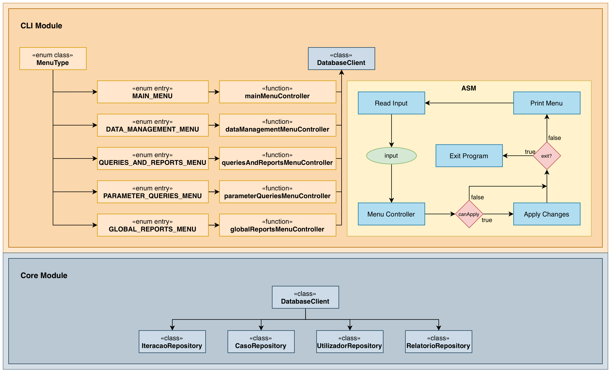
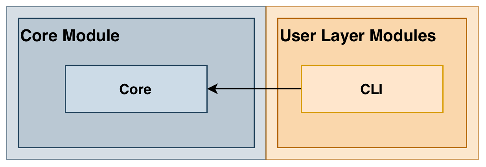

# ISIP3 - Cyberbullying Monitoring Platform

A Kotlin-based command-line application for monitoring and managing cyberbullying cases, built as part of the "Introduction to Information Systems" course (LEIC 2025-26).

Built using [KPB - Kotlin Project Builder](https://github.com/RafaPear/KPB).



## Project Overview

This project implements a comprehensive platform for managing cyberbullying incidents, including:

- **User Management**: Simple users, psychologists, and moderators with specialized roles
- **Interaction Tracking**: Recording and analyzing user interactions across multiple platforms
- **Case Management**: Creating, evaluating, and tracking cyberbullying cases
- **Reporting System**: Generating statistical reports and insights
- **Educational Resources**: Managing and tracking consultation of educational materials

### Key Features

- Multi-role user system (users, psychologists, moderators)
- Interaction flagging and analysis by moderators
- Case assignment to specialized psychologists by area (harassment, rumors, personal information sharing, identity theft)
- Severity grading and intervention tracking
- Comprehensive SQL-based queries and reports
- Command-line interface with interactive menus

## Architecture



The project is structured as a multi-module Gradle build:

### Modules

- **`core`**: Core business logic and database access layer
  - Repository pattern for database operations
  - Domain models and data classes
  - PostgreSQL connection management
  
- **`cli`**: Command-line interface
  - Interactive menu system
  - Controllers for data management and queries
  - User input validation and formatting utilities

## Documentation (Dokka)

This project includes comprehensive API documentation generated with Dokka. The documentation is **automatically generated** when you build the project.

### Viewing Documentation

```sh
./gradlew build
open build/dokka/index.html
```

**Note**: Running `./gradlew build` automatically triggers `dokkaGenerate` (configured in `build.gradle.kts`), so there's no need to run Dokka separately.

If your browser doesn't open automatically, manually navigate to `build/dokka/index.html`.

### What's Documented

- All public classes, functions, and properties
- Repository methods with usage examples
- Data models and enums
- Controller logic and menu navigation
- Utility functions for validation and formatting

## Prerequisites

- **JDK 21** or higher
- **PostgreSQL** database
- Environment variables:
  - `DB_URL`: PostgreSQL connection URL
  - `DB_USER`: Database username
  - `DB_PASSWORD`: Database password

## Building and Running

### Build the Project

```sh
./gradlew build
```

This command:
- Compiles all modules
- Runs tests
- Generates Dokka documentation
- Creates a fat JAR with all dependencies

### Run the Application

```sh
java -jar cli/build/libs/cli-1.0.jar
```

Or using Gradle:

```sh
./gradlew :cli:run
```

## Assignment Context

This repository implements **Part 3** of the assignment for the subject **"Introdução aos Sistemas de Informação" (Introduction to Information Systems)** - LEIC 2025-26.

**Assignment**: Cyberbullying Monitoring Platform  
**Part 3 - Published**: December 3, 2025  
**Due Date**: December 22, 2025

### Deliverables (Part 3)

1. **Database Population**: SQL DML scripts to populate the database with test data
2. **SQL Queries**: Implementation of 12 required queries (some with relational algebra equivalents)
3. **Kotlin Application**: CLI-based management system with:
   - Interaction reporting functionality
   - Interactive query execution
   - Global reports and statistics
4. **Final Report**: Comprehensive documentation including all three project parts

### Test Data Requirements

The database includes:
- 4 specialization areas
- 12 users (5 simple users, 4 psychologists, 3 moderators)
- 4 platforms
- 6 educational resources
- 18 interactions
- 20 cyberbullying cases in various states (initiated, evaluated, closed)

For detailed assignment requirements, see the project specification document.

## Database Schema

The application works with the following main entities:

- **UTILIZADOR** (User): Base user information
- **PSICOLOGO** (Psychologist): Specialized professionals with areas of expertise
- **MODERADOR** (Moderator): Content moderators who flag interactions
- **INTERACAO** (Interaction): User-generated content to be monitored
- **CASO_DE_CYBERBULLYING** (Cyberbullying Case): Flagged incidents requiring intervention
- **AVALIA** (Evaluation): Psychologist assessments with severity ratings
- **RECURSO_EDUCATIVO** (Educational Resource): Support materials by specialization

## License

Academic project for ISEL - Instituto Superior de Engenharia de Lisboa.  
**2025 ISEL - ISI**

