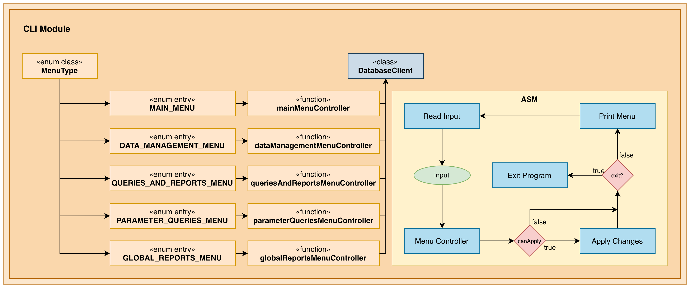

#Module cli

## Overview

The `cli` module provides an interactive command-line interface for administrators to manage the cyberbullying monitoring platform. It implements a hierarchical menu system with input validation, help commands, and formatted output display.

**Key Responsibilities:**
- User interaction and input validation
- Menu navigation using enum-based state machine
- Output formatting (tables with dynamic column sizing)
- Delegation of business logic to the `core` module

## Architecture

**Design Patterns:**
- **State Machine**: Type-safe enum-based menu navigation
- **Controller Pattern**: Each menu has an associated controller function
- **Separation of Concerns**: UI display separated from business logic

**Module Dependencies:**
- `core` module for all database operations
- PostgreSQL JDBC Driver (transitive)

## Environment Variables

| Variable | Description |
|----------|-------------|
| `DB_URL` | PostgreSQL JDBC connection string |
| `DB_USER` | Database username |
| `DB_PASSWORD` | Database password |

## Features

- **Interactive Help**: Type "help" at ID prompts to see available records
- **Date Validation**: YYYY-MM-DD format checking
- **Dynamic Tables**: Auto-sized columns with pipe-delimited output
- **Error Recovery**: Graceful error handling with clear messages

---

#Package pt.isel.cli

Main entry point and database connection management.

#Package pt.isel.cli.controller

Controllers for menu navigation and business logic coordination. Each controller processes user input, executes database operations via repositories, and determines the next menu state.

#Package pt.isel.cli.controller.util

Utility functions for date validation, query execution, table formatting, and the interactive help system.

#Package pt.isel.cli.ui.menus

Pure UI functions that display formatted menus. Contains only presentation logic with no business operations.

