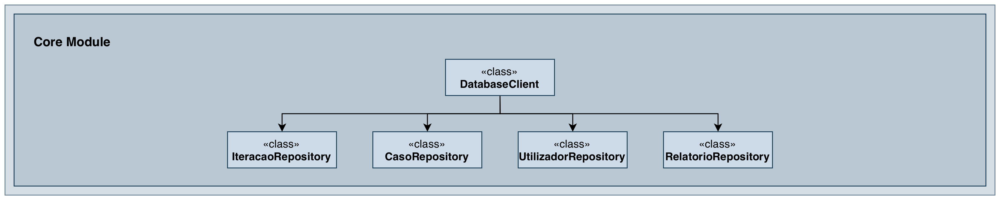

#Module core

## Overview

The `core` module provides the data access layer and business logic for the ISIP3 platform. It implements the Repository pattern to encapsulate all database operations and provides domain models representing business entities.

**Key Responsibilities:**
- Database operations through repository classes
- Domain models (User, Interacao, enums)
- SQL query implementation
- Connection management with AutoCloseable

## Architecture

**Design Patterns:**
- **Repository Pattern**: Each entity has a dedicated repository class
- **Factory Pattern**: DatabaseClient aggregates all repositories
- **Resource Management**: AutoCloseable for safe connection cleanup

**Key Components:**
- `DatabaseClient`: Central access point for all repositories
- `InteracaoRepository`: User interactions and moderator analysis
- `CasoRepository`: Cyberbullying cases and severity queries
- `UtilizadorRepository`: User management and complex queries
- `RelatorioRepository`: Statistical reports and aggregations

## Domain Models

**Data Classes:**
- `User`: System users with optional role information
- `Interacao`: User-generated content requiring monitoring

**Enumerations:**
- `TipoUtilizador`: User roles (PSICOLOGO, MODERADOR)
- `TipoInteracao`: Interaction types (MENSAGEM, COMENTARIO, RESPOSTA)
- `EstadoCaso`: Case states (INICIADO, AVALIADO, FECHADO, PUBLICO, INATIVO)

## Database

- **Engine**: PostgreSQL 12+
- **Access**: JDBC with prepared statements
- **Transactions**: Manual commit control where needed
- **Schema**: Relational model with foreign key constraints

---

#Package pt.isel.core.service

Contains all repository implementations, the database client, domain models, and enumerations. Provides methods for CRUD operations, complex queries with JOINs, aggregations, and statistical reports.

